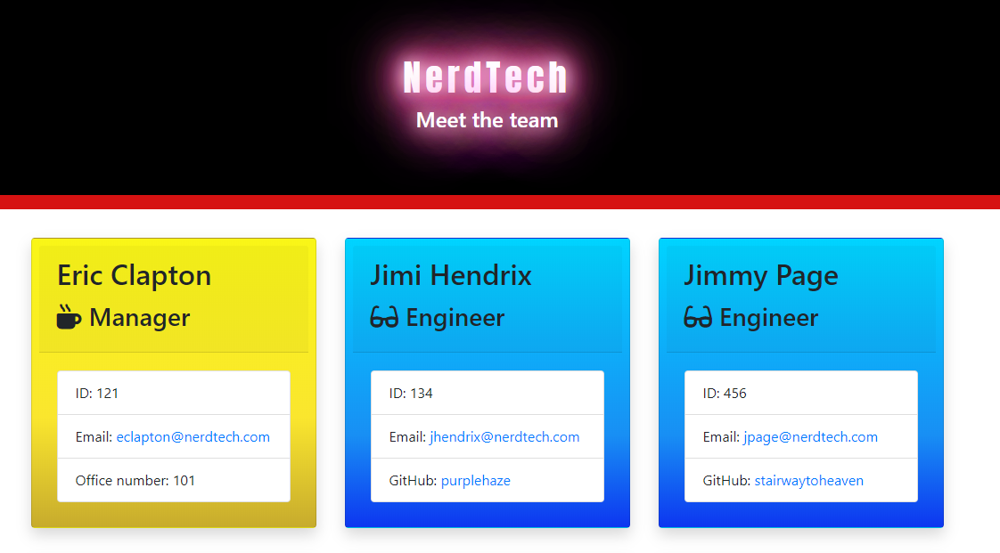

# 
Team Profile Generator

 Create a Team profile HTML page from text inputs. A Node CLI will use inquirer to gather input data for the team of employees.
 First the manager is prompted for his details then the prompts are repeated until the all team members are added. There is a choice of employee 
 or intern with different characteristics for each. The engineer will require a github ID while the intern requires the school they attended so classes
 are required.Each employee has their data written to a snippet of HTML. Upon finishing these blocks are written to the team.html file in the output folder.Some input validation is present to confirm the appropriate data is entered.

*****
## 
Table of Contents

* [Installation](https://github.com/craigfbarry/team-profile-generator#installation)

* [Usage](https://github.com/craigfbarry/team-profile-generator#usage)

* [LIcense](https://github.com/craigfbarry/team-profile-generator#license)

* [Contributing](https://github.com/craigfbarry/team-profile-generator#contributing)

* [Tests](https://github.com/craigfbarry/team-profile-generator#testing-framework)

* [Technologies Used](https://github.com/craigfbarry/team-profile-generator#technologies-used)

* [Author](https://github.com/craigfbarry/team-profile-generator#author)

* [Github URL](https://github.com/craigfbarry/team-profile-generator#github-url)

* [Acknowledgements](https://github.com/craigfbarry/team-profile-generator#acknowledgements)

*****

#### Installation

        Run NPM install and then node app.js

#### Usage

Used to collect data and render a HTML page of team members from text based inputs using node js.

#### License

#### Contributing

None

#### Testing framework

        Jest

#### Technologies used

        inquirer node fs npm jest

#### Author

[@craigfbarry](https://github.com/craigfbarry/)

#### Github URL

https://github.com/craigfbarry/team-profile-generator

#### Acknowledgements

https://www.w3schools.com/howto/howto_css_glowing_text.asp

    